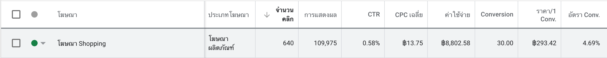
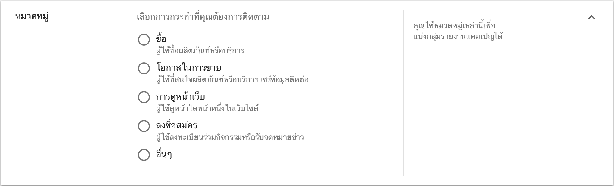
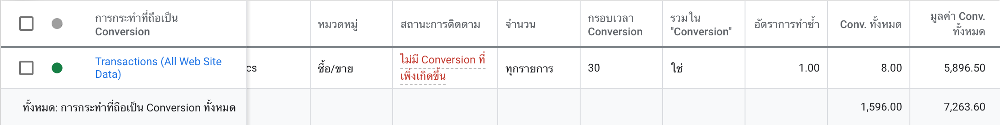

การทำโฆษณาผ่านช่องทางของ Google Ads ผู้คนส่วนมากจะเข้าใจว่าเราจะสามารถวัดผลโฆษณาได้แค่เฉพาะ จำนวนคลิก (Clicks) และ การแสดงผล (Impressions) ของโฆษณา

แต่ในความเป็นจริงแล้วเราสามารถติดตามพฤติกรรมและการกระทำของผู้ใช้งานที่เข้าเว็บไซต์ของเราผ่านช่องทางของโฆษณา Google Ads ได้อย่างละเอียดตามเงื่อนไขที่เราต้องการจะติดตามผู้ใช้งาน ซึ่งในส่วนนี้จะเรียกว่า **Conversion** และ **วิธีการติดตั้ง conversion ทาง Google Ads จะไม่มีการเรียกเก็บค่าบริการใดๆเพิ่มเติม !!**

### ข้อดีของการติดตั้ง Conversion
- สามาถตรวจสอบ Conversion ที่เกิดขึ้นเพื่อนำไปเปรียบเทียบกับค่าใช้จ่ายในการลงโฆษณาว่าคุ้มทุนหรือไม่
- สามารถตรวจสอบ Conversion ที่เกิดขึ้นได้ว่าเกิดจาก แคมเปญไหน, โฆษณาตัวไหนและ คีย์เวิร์ดตัวไหน
- สามารถเปลี่ยน **การเสนอราคา** เป็น "Conversion สูงสุด" ได้ ซึ่งตัวระบบจะเก็บข้อมูลพฤติกรรมผู้ใช้ที่เคยเกิด Conversion และแสดงโฆษณาให้กับผู้ใช้ที่มีพฤติกรรมใกล้เคียงกับผู้ใช้ก่อนหน้า ซึ่งวิธีการนี้จะทำให้เราเกิด Conversion มากขึ้น

### **Conversion** จะถูกแบ่งออกเป็น 4 ประเภทหลักดังนี้

- ซื้อ (Purchased) กลุ่มผู้ใช้ที่มีการกระทำซื้อสินค้าภายในเว็บไซต์ จากช่องทางโฆษณาของ Google Ads
- โอกาสในการขาย (Lead) กลุ่มผู้ใช้ที่มีการกระทำที่นำให้เกิดโอกาสในการขายจากช่องทางโฆษณาของ Google Ads ตัวอย่างเช่น ผู้ใช้มีการแอดไลน์เพื่อสอบถามข้อมูลเพิ่มเติม, ผู้ใช้มีติดต่อโทรหาเพื่อสอบถามข้อมูลเพิ่มเติม เป็นต้น
- การดูหน้าเว็บ (View of a key page) กลุ่มผู้ใช้ที่มีการเรียกดูหน้าเว็บสำคัญผ่านโฆษณาของ Google Ads ตัวอย่างเช่น มีการเรียกดูหน้าติดต่อเรา, มีการเรียกดูหน้าที่ผู้ลงโฆษณาต้องการสื่อสารกับผู้เข้าชม เป็นต้น
- ลงชื่อสมัคร (Register) กลุ่มผู้ใช้ที่มีการลงชื่อสมัครจากช่องทางโฆษณาของ Google Ads ตัวอย่างเช่น ผู้ใช้มีการลงชื่อสมัครสมาชิกกับเว็บไซต์หรือสมัครรับจดหมายข่าว, ผู้ใช้มีการกรอกแบบฟอร์มขอใบเสนอราคา เป็นต้น

### มูลค่าของ Conversion (Conversion Value)
มูลค่าของ Conversion คือตัววัดมูลค่าที่ได้จาก Conversion ที่เกิดขึ้น ยกตัวอย่างเช่น หากมีการติดตั้ง conversion สำหรับการซื้อสินค้าในเว็บไซต์ - มีผู้เข้าโฆษณาผ่าน Google Ads และทำการสั่งซื้อในเว็บไซต์ ตัวระบบก็จะทำการเก็บ**มูลค่าการซื้อขาย**ที่เกิดขึ้นมาเป็น **Conversion value** นั่นเอง

ซึ่ง Conversion value จะถูกแบ่งออกเป็น 3 ประเภทคือ
- ใช้มูลค่าเดียวกันกับทุก Conversion - ใช้สำหรับ conversion ที่ทุก conversion มีราคาเท่ากัน ตัวอย่างเช่น subscription ของ Netflix เป็นต้น
- ใช้มูลค่าต่างกันสำหรับ Conversion แต่ละรายการ - ใช้สำหรับ conversion ที่แต่ละ conversion มีราคาที่ต่างกัน ตัวอย่างเช่น การซื้อขายของออนไลน์บนเว็บไซต์
- อย่าใช้มูลค่ากับการกระทำที่ถือเป็น Conversion นี้ - จะใช้งานก็ต่อเมื่อเรายังไม่สามารถระบุยอดขายที่เกิดขึ้นจาก conversion นี้ได้ ตัวอย่างเช่น การเกิดโอกาสในการขาย(แอดไลน์,โทรศัพท์ติดต่อ) หรือการสมัครรับข่าวสาร เป็นต้น 

### กรอบเวลา Conversion (Conversion window)
ผู้ใช้งานมีการคลิกโฆษณาของเรามาครั้งแรก อาจจะไม่ได้มีการเกิด conversion เลย ซึ่งตัว กรอบเวลา conversion นี้จะเป็นการกำหนดระยะเวลาที่ผู้ใช้งานให้เรา ทางผมขอยกตัวอย่างเช่น ผมเข้าไปที่เว็บไซต์ร้านค้าหนึ่งเพื่อดูสินค้านั้น แต่ผมไม่สะดวกที่จะซื้อสินค้านั้นทันที ตัวระบบของกูเกิ้ลจะรู้ว่าผมคลิกเข้าโฆษณามาที่เว็บไซต์และกรอบเวลา conversion จะมีอายุ 30 วันนับจากวันที่คลิกโฆษณาเข้ามา อยู่มาวันดีคืนดีภายใน 30 วันผมกลับเข้ามาที่เว็บไซต์และซื้อสินค้าซึ่งเป็น conversion ของเว็บไซต์นั้น ผมจะถูกนับว่าเป็น 1 conversion ทันที เนื่องจากผมยังอยู่ในกรอบเวลาอยู่ อีกกรณีหนึ่งคือผมกลับเข้ามาที่เว็บไซต์และซื้อสินค้าเกินระยะเวลา 30 วัน ทางระบบของกูเกิ้ลจะไม่นับว่าผมเป็น conversion ที่เกิดขึ้นจากโฆษณาแล้ว

ตัว **กรอบเวลา conversion** มีประโยชน์คือ บางกลุ่มธุรกิจทางผู้ใช้งานอาจจะต้องใช้เวลาในการตัดสินใจนานพอสมควรจนกว่าจะเกิด conversion เช่น สินเชื่อบ้าน หรือรถยนต์ เป็นต้น ทำให้เราสามารถกำหนดกรอบเวลา conversion ให้นานขึ้นได้

### รูปแบบการระบุแหล่งที่มา (Attribution Model)
ผู้ใช้บางคนอาจจะมีการคลิกโฆษณาของเราผ่าน Google Ads มากกว่าหนึ่งตัว ซึ่งตัวระบบจะไม่รู้ว่าต้องให้เครดิตการเกิด conversion กับโฆษณาตัวไหนหรือคีย์เวิร์ดตัวไหนที่ลูกค้าเข้ามา ซึ่งตัว **รูปแบบการระบุแหล่งที่มา** จะสามารถทำให้เราเก็บข้อมูลเครดิตของ conversion ตามที่เราต้องการได้ ซึ่งแบ่งออกเป็น 5 ประเภทด้วยกัน
- คลิกสุดท้าย (Last click) - conversion จะถูกให้เครดิตไปกับโฆษณาตัวสุดท้ายและคีย์เวิร์ดสุดท้ายที่ลูกค้าคลิกโฆษณา
- คลิกครั้งแรก (First click) - conversion จะถูกให้เครดิตไปกับโฆษณาตัวแรกและคีย์เวิร์ดแรกที่ลูกค้าคลิกโฆษณา
- เชิงเส้น (Linear) - conversion จะถูกให้เครดิตไปกับโฆษณาและคีย์เวิร์ดที่ผู้ใช้ค้นหาเท่าๆกัน
- การลดลงตามเวลา (Time Decay) - conversion จะถูกให้เครดิตไปกับโฆษณาและคีย์เวิร์ดที่ใกล้เคียงไปเวลาที่เกิด conversion มากที่สุด 
- ตามตำแหน่ง - conversion จะถูกให้เครดิต 40% แก่ทั้งคลิกแรกและคลิกสุดท้าย และกระจาย 20% ที่เหลือให้คลิกอื่นๆ

ซึ่งวิธีการติดตั้ง conversion ลงในเว็บไซต์เพื่อชี้วัดผู้เข้าโฆษณา ทางผมจะมาอธิบายให้ในบทความหน้าครับ